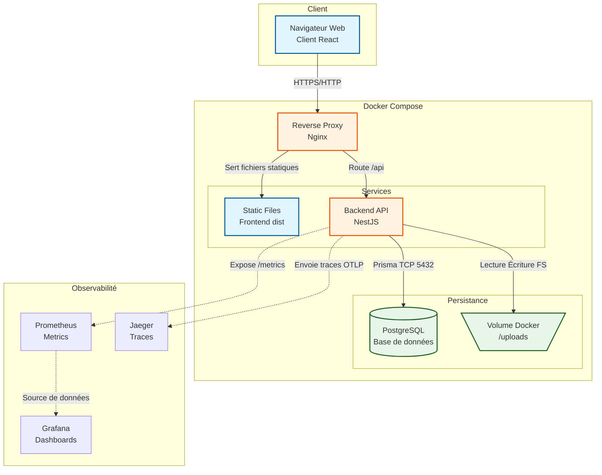

# Choix Technologiques & Architecture

## Choix du Stack Technique

| Élément | Technologie choisie | Alternatives écartées | Justification |
|---|---|---|---|
| Backend | **NestJS (TypeScript)** | Spring Boot, Symfony, .NET Core | Architecture modulaire native très proche d'Angular, ce qui favorise une structure propre. L'utilisation de TypeScript de bout en bout (avec React) accélère le développement et facilite le partage de types. Écosystème NPM très riche pour répondre aux besoins en 4 semaines. |
| Frontend | **React + Vite + TypeScript** | Angular, VueJS | Standard de facto très demandé. Vite offre une Developer Experience (DX) excellente (temps de build ultra rapides). React s'aligne très bien avec le développement rapide d'un MVP. |
| Base de données | **PostgreSQL** | MongoDB | Données structurées avec des relations claires (User -> File -> Tag). PostgreSQL offre robustesse, contraintes d'intégrité référentielle, et une très bonne intégration avec Docker et Prisma (ORM). |
| ORM | **Prisma** | TypeORM, Sequelize | Génération automatique des types TypeScript à partir du schéma. Migrations de base de données simples et sûres. Très forte productivité pour le backend. |
| Stockage | **Système de fichiers local** | AWS S3, MinIO | Imposé par les contraintes (volume Docker monté). |
| Auth | **JWT (Access 15m + Refresh 7j)** | Sessions serveur, OAuth | Imposé par le brief. Séparation en access/refresh pour un bon compromis sécurité (vol de token) / UX (pas de reconnexion fréquente). |
| Tests unitaires | **Jest (Back) / Vitest (Front)** | Mocha, Jasmine | Standards dans l'écosystème Node.js/React. Exécution rapide, mocks intégrés. |
| Tests E2E | **Cypress** | Playwright | Recommandé par le brief. Très bonne DX pour tester les flux utilisateurs (inscription, upload, téléchargement). |
| Performance | **k6** | Artillery, JMeter | Recommandé par le brief. Écriture des tests en JS, métriques très claires (P95, RPS). |
| Serveur Web / Proxy | **Nginx** | Apache, Traefik | Léger, très performant pour servir le frontend buildé et faire office de reverse proxy vers l'API backend dans Docker Compose. |
| **Observabilité (Logs, Traces, Métriques)** | **Pino (Logs) + Prometheus/Grafana (Metrics) + Jaeger (Traces)** | ELK Stack, Datadog | **Logs**: Pino pour des logs JSON structurés ultra-rapides (essentiel pour l'analyse machine). **Métriques**: Prometheus via NestJS (ex: compteurs HTTP, erreurs, latence) visualisées sur Grafana. **Traces**: Jaeger (OpenTelemetry) pour suivre une requête de bout en bout (Nginx -> Backend -> DB). |

## Diagramme d'Architecture

### Description des composants :
- **Browser** : Interface utilisateur (SPA React).
- **Nginx** : Sert les fichiers statiques du frontend et redirige les requêtes commençant par `/api` vers le backend.
- **Backend (NestJS)** : Reçoit les requêtes HTTP, gère la logique métier (Auth, validation, gestion de fichiers), communique avec la DB via Prisma et stocke les fichiers.
- **PostgreSQL** : Stocke les utilisateurs, les métadonnées des fichiers et les tags.
- **Volume Local** : Dossier partagé via Docker pour le stockage physique des fichiers uploadés.
