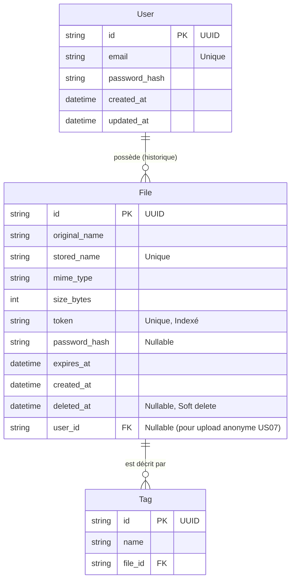

# Modèle de Données (MCD)

## Schéma Entité-Association (Mermaid)



## Description des Entités

### 1. User
Stocke les informations d'authentification des utilisateurs.
- **id** : Identifiant unique (UUID).
- **email** : Adresse email (unique).
- **password_hash** : Mot de passe haché avec bcrypt.
- **created_at** / **updated_at** : Timestamps standards.

### 2. File
Stocke les métadonnées des fichiers uploadés. Le fichier physique est stocké sur le disque sous le nom `stored_name`.
- **id** : UUID.
- **original_name** : Nom du fichier d'origine (ex: `document.pdf`).
- **stored_name** : Nom unique sur le disque (UUID généré lors de la sauvegarde).
- **mime_type** : Type de fichier (ex: `application/pdf`).
- **size_bytes** : Taille en octets (limité à 1 Go).
- **token** : Jeton cryptographiquement sûr pour l'URL de téléchargement (indexé pour recherche rapide).
- **password_hash** : (Optionnel) Hash bcrypt du mot de passe de protection.
- **expires_at** : Date d'expiration (par défaut +7j).
- **created_at** : Date d'upload.
- **deleted_at** : Date de suppression logique (soft delete, optionnel si on purge directement).
- **user_id** : Clé étrangère vers l'utilisateur. Nullable pour permettre les uploads anonymes (US07).

### 3. Tag
Stocke les tags associés à un fichier.
- **id** : UUID.
- **name** : Nom du tag (ex: "Urgent", max 30 caractères).
- **file_id** : Clé étrangère vers le fichier concerné. Une contrainte d'unicité `(name, file_id)` sera appliquée pour éviter les doublons sur un même fichier.

## Script DDL Simplifié (PostgreSQL)

*Note : La base sera gérée via Prisma, ce script est donné à titre indicatif pour visualiser le schéma SQL généré.*

```sql
CREATE TABLE "users" (
    "id" UUID NOT NULL DEFAULT gen_random_uuid(),
    "email" TEXT NOT NULL,
    "password_hash" TEXT NOT NULL,
    "created_at" TIMESTAMP(3) NOT NULL DEFAULT CURRENT_TIMESTAMP,
    "updated_at" TIMESTAMP(3) NOT NULL,

    CONSTRAINT "users_pkey" PRIMARY KEY ("id")
);

CREATE UNIQUE INDEX "users_email_key" ON "users"("email");

CREATE TABLE "files" (
    "id" UUID NOT NULL DEFAULT gen_random_uuid(),
    "original_name" TEXT NOT NULL,
    "stored_name" TEXT NOT NULL,
    "mime_type" TEXT NOT NULL,
    "size_bytes" INTEGER NOT NULL,
    "token" TEXT NOT NULL,
    "password_hash" TEXT,
    "expires_at" TIMESTAMP(3) NOT NULL,
    "created_at" TIMESTAMP(3) NOT NULL DEFAULT CURRENT_TIMESTAMP,
    "deleted_at" TIMESTAMP(3),
    "user_id" UUID,

    CONSTRAINT "files_pkey" PRIMARY KEY ("id")
);

CREATE UNIQUE INDEX "files_stored_name_key" ON "files"("stored_name");
CREATE UNIQUE INDEX "files_token_key" ON "files"("token");

CREATE TABLE "tags" (
    "id" UUID NOT NULL DEFAULT gen_random_uuid(),
    "name" VARCHAR(30) NOT NULL,
    "file_id" UUID NOT NULL,

    CONSTRAINT "tags_pkey" PRIMARY KEY ("id")
);

CREATE UNIQUE INDEX "tags_name_file_id_key" ON "tags"("name", "file_id");

ALTER TABLE "files" ADD CONSTRAINT "files_user_id_fkey" FOREIGN KEY ("user_id") REFERENCES "users"("id") ON DELETE SET NULL ON UPDATE CASCADE;
ALTER TABLE "tags" ADD CONSTRAINT "tags_file_id_fkey" FOREIGN KEY ("file_id") REFERENCES "files"("id") ON DELETE CASCADE ON UPDATE CASCADE;